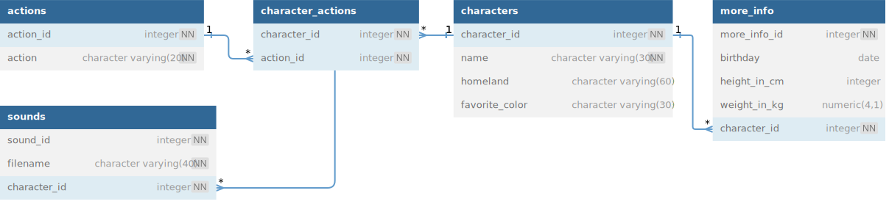

# Mario Database

This repository is dedicated to the **Relational Database course from freeCodeCamp**. The course involves learning the basics of a relational database by creating a `PostgreSQL` database filled with video game characters.

## About the Database

The database created in this course is a `PostgreSQL` database. It is designed to store data about video game characters, specifically from the *Mario* franchise. The data is organized into tables that are linked together through relationships, embodying the core concept of a relational database.

## Course Description

The Relational Database course from **freeCodeCamp** is a comprehensive **165-lesson course**. It provides a deep dive into the basics of relational databases, using the practical approach of building a `PostgreSQL` database.

## Database Diagram

*Please refer to the diagram above for the structure of the Mario Database.*

## Course Link

For more information about the course, please visit [freeCodeCamp's Relational Database Course](https://www.freecodecamp.org/learn/relational-database).